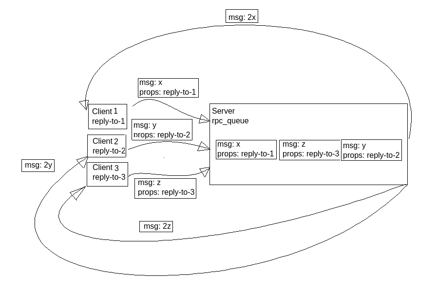

# Работа с брокером сообщений. Описание.

## Выбор exchange
**Тип обменника**: 
Exchange (обменник) для этой задачи достаточен ```AMQP default (direct)```.

**Почему**:
Потому что остальные типы обменников нужны для более сложных задач, для нашей подойдёт самый простой.

## Взаимодействие клиента и сервера
### Клиентская часть
Клиент реализует подключение к брокеру rabbitmq.
- Создаётся ```connection```.
- Создаётся ```TCP-socket```.
- Открывается ```TCP-socket```.
- Клиент авторизуется в брокере с логином/паролем guest/guest.
- Создается и открывается ```channel```.

Далее:
- Клиент создаёт на обменнике ```AMQP default``` ```reply-to``` очередь, в которую север будет отправлять ответ.
- Клиент устанавливает ```consumer``` на  ```reply-to```.
- Клиент формирует сообщение: в ```props``` указывается тип сообщения  ```text/plain``` и ```reply-to``` имя очереди, в которую сервер должен отправить ответ.
- Клиент отправляет сообщение на брокер в очередь ```rpc_queue```(которую объявляет сервер) и начинает в бесконечном цикле прослушивать ```reply-to``` очередь на наличие ответа.

### Серверная часть
Сервер точно так же реализует подключение к брокеру rabbitmq.
- Создаётся ```connection```.
- Создаётся ```TCP-socket```
- Открывается ```TCP-socket```.
- Сервер авторизуется в брокере с логином/паролем guest/guest.
- Создается и открывается ```channel```.

Далее:
- Сервер объявляет очередь ```rpc_queue``` на обменнике ```AMQP default```.
- Устанавливает ```consumer``` на ```rpc_queue``` и начинает в бесконечном цикле прослушивать ```rpc_queue``` на наличие сообщений от клиента. 
- В главном цикле сервера формируется ответ и отправляется в ``` reply-to``` очередь, имя которой получено из ```props``` входящего сообщения.  

### Важные замечания
- Обменник ```AMQP default``` уже создан на брокере автоматически. В него приходят сообщения, если они не адресованы ни в какие другие обменники/очереди. 
- Тип обменника ```AMQP default``` - ```direct```.
- Не нужно явно использовать ```amqp_queue_bind```, потому что очереди создаются на ```AMQP default``` обменнике и привязываются к нему автоматически.
- **Независимость порядка запуска** обеспечивается при помощи таймаутов. Они реализованы в ``` amqp_consume_message(conn, &envelope, &timeout, 0)```
- Таймаут сервера - 10 секунд, таймаут клиента - 2 секунды.
- Соответственно и клиент, и сервер можно запускать в любом порядке.
- **Поддержка нескольких клиентов** в придуманной мной архитектуре обеспечена. ```n``` клиентов отправляют свои сообщения в очередь ```rpc_queue```, сервер разбирает сообщения по одному и отправляет ответы в очереди, которые указаны в ```envelope``` как ```reply_to```.
### Диаграмма взаимодействия 
 